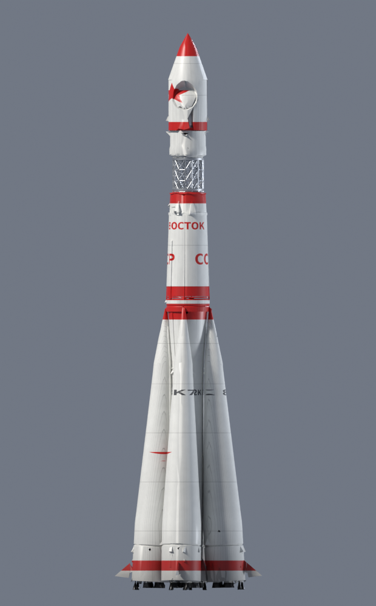

# Vostok 1 — Launch, Orbit & Landing

An interactive WebGL visualization of **Yuri Gagarin's Vostok 1 mission**
(12 April 1961), rendered as one continuous shot: the Baikonur launch pad,
ignition and lift-off, the gravity turn with the sky darkening to space,
Korolev-cross strap-on separation, shroud jettison, core staging, the Block-E
burn, orbital insertion into the real 181 × 327 km orbit, then retrofire,
re-entry, parachute deployment, Gagarin's own ejection and descent, and
touchdown on the Saratov steppe.



## Running

It is a static site — no build step. Serve the directory with any web server:

```bash
python3 -m http.server 8000
# then open http://localhost:8000/launch.html
```

- `launch.html` — the full mission animation
- `index.html` — a simple model viewer for the Vostok 8K72K stack

## Controls

| Control | Action |
|---|---|
| `Space` / play button | play / pause |
| timeline slider | seek to any mission moment |
| `0.25×–2×` | playback rate (mission runs at ~70× real time) |
| `R` / restart | back to T-10 s |
| `C` / camera buttons | toggle auto camera / free look |
| `?t=0.62` | deep-link a normalized mission time (e.g. `&play=0` to freeze) |

## What is simulated

- **Flight profile** — real event times: strap-on sep T+119 s, shroud T+154 s,
  core sep T+299 s, Block-E cutoff T+676 s, spacecraft sep T+688 s, retrofire
  T+78 min, touchdown T+108 min; live readouts for altitude, velocity, g-load,
  mass (with propellant burn and stage drops) and range to pad.
- **Vehicle dynamics** — gravity turn, hot-staged Block-E ignition, Korolev
  cross, retrograde TDU-1 burn with the capsule tail-first, ~8 g re-entry.
- **Effects** — shader plumes with animated soft edges and mach diamonds,
  per-nozzle booster/vernier jets, a particle sheath for turbulent flame,
  staging flashes, re-entry plasma and trail, pad smoke, steppe dust.
- **Environment** — day-to-space sky transition, NASA Blue Marble Earth with
  clouds, night lights and atmosphere limb, correct 64.95° orbit inclination
  over the real Baikonur latitude.
- **Models** — the R-7/Vostok stack (GLB), a procedurally rebuilt accurate
  3KA capsule, and a MakeHuman cosmonaut in an SK-1-style suit who ejects at
  7 km and lands under his own parachute beside the capsule.

## Project layout

```
index.html / main.js      model viewer
launch.html / launch.js   mission animation (all simulation code)
assets/                   GLB models, textures, Blender source
vendor/                   three.js + addons (no npm required)
tools/                    Blender Python scripts that regenerate the models
preview.png
```

## Rebuilding the models

The capsule and cosmonaut are generated by Blender Python scripts in `tools/`
(developed with Blender 5.2 + the MPFB MakeHuman plugin; adjust the paths at
the top of each script):

```bash
blender --background --python tools/build_capsule.py     # rebuilds vostok-1.glb
blender --background --python tools/build_cosmonaut.py   # rebuilds gagarin.glb
```

## Credits

- [three.js](https://threejs.org) (MIT) — rendering.
- NASA Blue Marble Earth imagery (public domain) — see
  `assets/textures/earth/SOURCES.md`.
- [MPFB — MakeHuman Plugin for Blender](http://www.makehumancommunity.org/) —
  cosmonaut base mesh.
- Flight-profile figures: russianSpaceweb (Gerchik/Zak), ESA, and the TASS
  orbital announcement of 12 April 1961.
